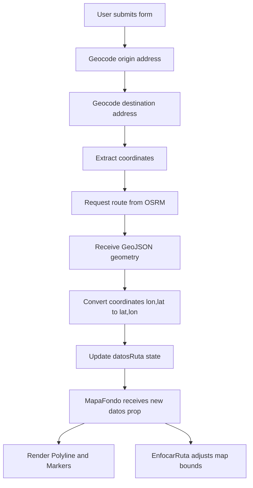

## Overview

Mi Ruta Directa uses the **OSRM (Open Source Routing Machine)** API to calculate optimal driving routes between two locations. After addresses are geocoded into coordinates, OSRM computes the best path and returns detailed geometry for displaying on the map.

## How Route Calculation Works

<Steps>
  <Step title="Geocode Addresses">
    Origin and destination addresses are converted to coordinates using the Photon API
  </Step>
  
  <Step title="Request Route from OSRM">
    Coordinates are sent to the OSRM routing API with specific parameters
  </Step>
  
  <Step title="Process Geometry">
    Route geometry is converted from GeoJSON format to Leaflet-compatible coordinates
  </Step>
  
  <Step title="Update State">
    Route data (coordinates, origin, destination) is stored in React state
  </Step>
  
  <Step title="Render on Map">
    The MapaFondo component displays the route as a polyline with markers
  </Step>
</Steps>

## Implementation

### Route State Management

Route data is managed using the `RutaDatos` interface:

```tsx src/interface/interfaces.ts
export interface RutaDatos {
  coordenadas: [number, number][]; 
  origen: [number, number] | null;
  destino: [number, number] | null;
}
```

State initialization in `App.tsx:13-17`:

```tsx src/App.tsx
const [datosRuta, setDatosRuta] = useState<RutaDatos>({
  coordenadas: [],
  origen: null,
  destino: null,
});
```

### OSRM API Integration

After successful geocoding, the route is calculated from `App.tsx:38-50`:

```tsx src/App.tsx
const [lonO, latO] = dataOrigen.features[0].geometry.coordinates;
const [lonD, latD] = dataDestino.features[0].geometry.coordinates;

const resRuta = await fetch(
  `https://router.project-osrm.org/route/v1/driving/${lonO},${latO};${lonD},${latD}?overview=full&geometries=geojson`
);

const datosRuta = await resRuta.json();

if (datosRuta.routes && datosRuta.routes.length > 0) {
  const ruta = datosRuta.routes[0];
  const coordenadasRuta = ruta.geometry.coordinates.map(
    (coord: [number, number]) => [coord[1], coord[0]]
  );
  
  setDatosRuta({
    coordenadas: coordenadasRuta,
    origen: [latO, lonO],
    destino: [latD, lonD]
  })
}
```

## OSRM API Parameters

The OSRM API endpoint follows this structure:

```
https://router.project-osrm.org/route/v1/{profile}/{coordinates}?{options}
```

### URL Components

| Component | Value | Description |
|-----------|-------|-------------|
| Base URL | `https://router.project-osrm.org` | Public OSRM instance |
| Service | `route` | Route calculation service |
| Version | `v1` | API version |
| Profile | `driving` | Routing profile (car) |
| Coordinates | `{lon},{lat};{lon},{lat}` | Origin and destination |

### Query Parameters

| Parameter | Value | Description |
|-----------|-------|-------------|
| `overview` | `full` | Returns complete route geometry |
| `geometries` | `geojson` | Geometry format (GeoJSON) |

<CodeGroup>
```bash Example Request
https://router.project-osrm.org/route/v1/driving/-74.7813,10.9685;-74.7950,10.9820?overview=full&geometries=geojson
```

```json Example Response
{
  "routes": [
    {
      "geometry": {
        "coordinates": [
          [-74.7813, 10.9685],
          [-74.7825, 10.9700],
          [-74.7950, 10.9820]
        ],
        "type": "LineString"
      },
      "legs": [...],
      "distance": 2543.5,
      "duration": 345.2
    }
  ]
}
```
</CodeGroup>

<Info>
  The OSRM API accepts coordinates in `[longitude, latitude]` order, while Leaflet uses `[latitude, longitude]`. The app handles this conversion automatically.
</Info>

## Coordinate Conversion

One of the most critical aspects of route calculation is coordinate conversion:

### Why Conversion is Needed

- **OSRM/GeoJSON format**: `[longitude, latitude]`
- **Leaflet format**: `[latitude, longitude]`

The conversion happens using `Array.map()` at `App.tsx:44`:

```tsx src/App.tsx
const coordenadasRuta = ruta.geometry.coordinates.map(
  (coord: [number, number]) => [coord[1], coord[0]]
);
```

<Warning>
  Forgetting to swap coordinates will cause routes to display in the wrong location or not at all. Always verify coordinate order when working with different mapping libraries.
</Warning>

## Displaying Routes on the Map

Once route data is stored in state, it's passed to the `MapaFondo` component:

```tsx src/App.tsx
<MapaFondo datos={datosRuta} />
```

The `MapaFondo` component renders the route from `MapaFondo.tsx:40-49`:

```tsx src/components/MapaFondo.tsx
{datos.coordenadas.length > 0 && (
  <Polyline positions={datos.coordenadas} color="blue" />
)}

{datos.origen !== null && (
  <Marker position={datos.origen} />
)}

{datos.destino !== null && (
  <Marker position={datos.destino} />
)}
```

### Auto-Fit Route Bounds

The `EnfocarRuta` control automatically adjusts the map to show the entire route:

```tsx src/components/MapaControles.tsx
export const EnfocarRuta = ({ coordenadas }: { coordenadas: [number, number][] }) => {
  const map = useMap();
  
  useEffect(() => {
    if (coordenadas.length > 0) {
      map.fitBounds(coordenadas, { padding: [50, 50] });
    }
  }, [coordenadas, map])

  return null;
}
```

<Tip>
  The `fitBounds` method with padding ensures the entire route is visible with comfortable margins, improving user experience.
</Tip>

## Route Data Flow



## Error Handling

The current implementation validates that routes exist before processing:

```tsx src/App.tsx
if (datosRuta.routes && datosRuta.routes.length > 0) {
  const ruta = datosRuta.routes[0];
  // Process route...
}
```

<Warning>
  The app doesn't provide user feedback if OSRM fails to find a route. Silent failures can confuse users who expect a route to appear.
</Warning>

## Limitations & Potential Improvements

<Accordion title="No alternative routes">
  Only the first (optimal) route is displayed. OSRM can return multiple route options that users might prefer based on distance vs. time trade-offs.
</Accordion>

<Accordion title="No route metadata displayed">
  The OSRM response includes useful information like distance, duration, and turn-by-turn instructions, but these aren't shown to users.
</Accordion>

<Accordion title="Only driving profile supported">
  OSRM supports multiple profiles (walking, cycling, driving), but the app is hardcoded to `driving` mode.
</Accordion>

<Accordion title="No route persistence">
  Routes are lost on page refresh. Adding local storage or URL parameters could preserve route data.
</Accordion>

## Advanced Usage

### Adding Turn-by-Turn Instructions

To get step-by-step directions, modify the OSRM request to include the `steps` parameter:

```tsx
const resRuta = await fetch(
  `https://router.project-osrm.org/route/v1/driving/${lonO},${latO};${lonD},${latD}?overview=full&geometries=geojson&steps=true`
);
```

### Supporting Multiple Waypoints

OSRM supports routing through multiple waypoints:

```tsx
// Format: lon,lat;lon,lat;lon,lat
const waypoints = `${lon1},${lat1};${lon2},${lat2};${lon3},${lat3}`;
const url = `https://router.project-osrm.org/route/v1/driving/${waypoints}?overview=full&geometries=geojson`;
```

<Note>
  The public OSRM instance is free but may have rate limits. For production applications with high traffic, consider hosting your own OSRM instance.
</Note>